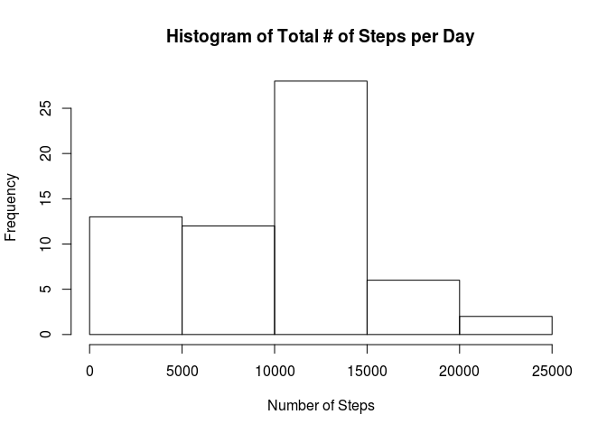
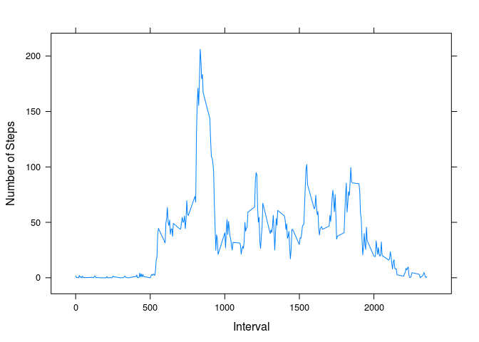
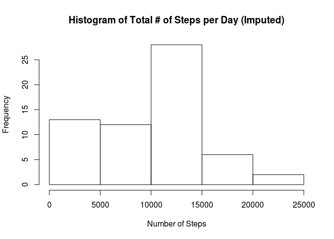
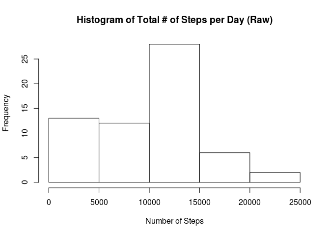
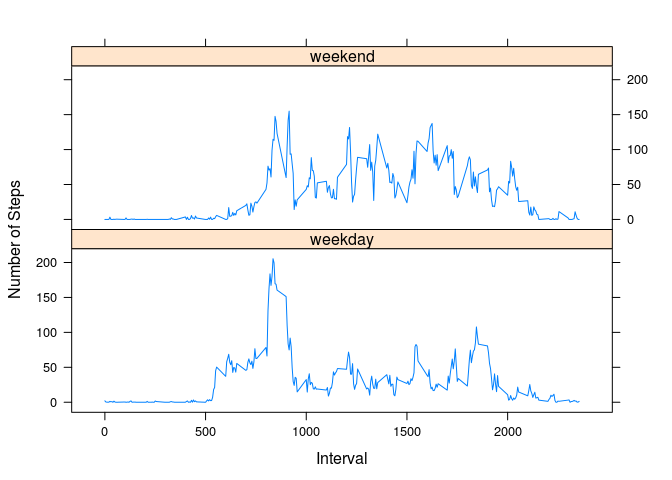

# Reproducible Research - Assignment 1
Luke Vicens  
02/13/2015  

# Loading and preprocessing the data
### We'll need the following libraries for processing and plotting:

```r
library(dplyr)
```

```
## 
## Attaching package: 'dplyr'
## 
## The following object is masked from 'package:stats':
## 
##     filter
## 
## The following objects are masked from 'package:base':
## 
##     intersect, setdiff, setequal, union
```

```r
library(lattice)
```

### Load the data and set interval as a factor:

```r
setwd('~/Documents/Coursera//Reproducible Research/Assignment 1/')
ActivityData <- read.csv('activity.csv')
ActivityData$interval <- as.factor(ActivityData$interval)
```

# What is the total number of steps taken per day?
### Calculate the total number of steps taken per day:

```r
StepsPerDay <- group_by(ActivityData, date)
TotalStepsPerDay <- summarise(StepsPerDay, sum(steps, na.rm = TRUE))
TotalStepsPerDay
```

```
## Source: local data frame [61 x 2]
## 
##          date sum(steps, na.rm = TRUE)
## 1  2012-10-01                        0
## 2  2012-10-02                      126
## 3  2012-10-03                    11352
## 4  2012-10-04                    12116
## 5  2012-10-05                    13294
## 6  2012-10-06                    15420
## 7  2012-10-07                    11015
## 8  2012-10-08                        0
## 9  2012-10-09                    12811
## 10 2012-10-10                     9900
## ..        ...                      ...
```

### Plot histogram of total number of steps taken per day:

```r
hist(TotalStepsPerDay$sum, xlab="Number of Steps", main="Histogram of Total # of Steps per Day")
```

 

### Calculate and report the mean and median of the total number of steps taken per day:

```r
MeanStepsPerDay <- summarise(StepsPerDay, mean(steps, na.rm = TRUE))
MeanStepsPerDay
```

```
## Source: local data frame [61 x 2]
## 
##          date mean(steps, na.rm = TRUE)
## 1  2012-10-01                       NaN
## 2  2012-10-02                   0.43750
## 3  2012-10-03                  39.41667
## 4  2012-10-04                  42.06944
## 5  2012-10-05                  46.15972
## 6  2012-10-06                  53.54167
## 7  2012-10-07                  38.24653
## 8  2012-10-08                       NaN
## 9  2012-10-09                  44.48264
## 10 2012-10-10                  34.37500
## ..        ...                       ...
```

```r
MedianStepsPerDay <- summarise(StepsPerDay, median(steps, na.rm = TRUE))
MedianStepsPerDay
```

```
## Source: local data frame [61 x 2]
## 
##          date median(steps, na.rm = TRUE)
## 1  2012-10-01                          NA
## 2  2012-10-02                           0
## 3  2012-10-03                           0
## 4  2012-10-04                           0
## 5  2012-10-05                           0
## 6  2012-10-06                           0
## 7  2012-10-07                           0
## 8  2012-10-08                          NA
## 9  2012-10-09                           0
## 10 2012-10-10                           0
## ..        ...                         ...
```

# What is the average daily activity pattern?
### Plot the average number of steps taken per interval, across all days:

```r
StepsPerInterval <- group_by(ActivityData, interval)
AvgStepsPerInterval <- summarise(StepsPerInterval, mean(steps, na.rm = TRUE))
colnames(AvgStepsPerInterval)[2] <- 'average.steps'
xlabs <- seq(0, max(as.integer(levels(AvgStepsPerInterval$interval))), by=500)
xyplot(average.steps ~ as.integer(levels(interval)[interval]), 
       data = AvgStepsPerInterval, 
       type = "l", 
       scales=list(x=list(at=xlabs, labels=xlabs)), 
       ylab="Number of Steps", xlab="Interval")
```

 

### Which interval has the highest average number of steps?

```r
filter(AvgStepsPerInterval, AvgStepsPerInterval$average.steps == max(AvgStepsPerInterval$average.steps))
```

```
## Source: local data frame [1 x 2]
## 
##   interval average.steps
## 1      835      206.1698
```

# Imputing missing values
### Calculate and report the total number of missing values in the dataset:

```r
sum(!complete.cases(ActivityData))
```

```
## [1] 2304
```
### Devise a strategy for filling in all the missing values in the dataset
We want to use summary data from either the same day or interval to fill in missing values. Because some days don't have any data at all from which to impute, we'll use interval summary data, specifically the median value for each interval.

### Create a new dataset that is equal to the original dataset but with the missing data filled in:

```r
MedianStepsPerInterval <- summarise(StepsPerInterval, median(steps, na.rm = TRUE))
completeRecords <- filter(ActivityData, !is.na(steps))
incompleteRecords <- filter(ActivityData, is.na(steps))
imputedRecords <- merge(incompleteRecords, MedianStepsPerInterval)
imputedRecords <- imputedRecords[,c(4,3,1)]
colnames(imputedRecords)[1] <- "steps"
imputedActivityData <- rbind(completeRecords, imputedRecords)
```
### Make a histogram of the total number of steps taken each day:

```r
imputedStepsPerDay <- group_by(imputedActivityData, date)
imputedTotalStepsPerDay <- summarise(imputedStepsPerDay, sum(steps, na.rm = TRUE))
hist(imputedTotalStepsPerDay$sum, xlab="Number of Steps", main="Histogram of Total # of Steps per Day (Imputed)")
```

 
Note that the histogram with imputed data above looks identical to the histogram from the raw dataset below:

```r
hist(TotalStepsPerDay$sum, xlab="Number of Steps", main="Histogram of Total # of Steps per Day (Raw)")
```

 

### Calculate and report the mean and median total number of steps taken per day

```r
imputedMeanStepsPerDay <- summarise(imputedStepsPerDay, mean(steps, na.rm = TRUE))
imputedMeanStepsPerDay
```

```
## Source: local data frame [61 x 2]
## 
##          date mean(steps, na.rm = TRUE)
## 1  2012-10-01                  3.961806
## 2  2012-10-02                  0.437500
## 3  2012-10-03                 39.416667
## 4  2012-10-04                 42.069444
## 5  2012-10-05                 46.159722
## 6  2012-10-06                 53.541667
## 7  2012-10-07                 38.246528
## 8  2012-10-08                  3.961806
## 9  2012-10-09                 44.482639
## 10 2012-10-10                 34.375000
## ..        ...                       ...
```

```r
imputedMedianStepsPerDay <- summarise(imputedStepsPerDay, median(steps, na.rm = TRUE))
imputedMedianStepsPerDay
```

```
## Source: local data frame [61 x 2]
## 
##          date median(steps, na.rm = TRUE)
## 1  2012-10-01                           0
## 2  2012-10-02                           0
## 3  2012-10-03                           0
## 4  2012-10-04                           0
## 5  2012-10-05                           0
## 6  2012-10-06                           0
## 7  2012-10-07                           0
## 8  2012-10-08                           0
## 9  2012-10-09                           0
## 10 2012-10-10                           0
## ..        ...                         ...
```
Note that there is no difference between the mean and median values calculated with raw vs imputed data:

```r
sum(MeanStepsPerDay$mean - imputedMeanStepsPerDay$mean, na.rm = TRUE)
```

```
## [1] 0
```

```r
sum(MedianStepsPerDay$median - imputedMedianStepsPerDay$median, na.rm = TRUE)
```

```
## [1] 0
```
The only difference is that means can now be calculated for days that lacked any complete cases in the original dataset.

# Are there differences in activity patterns between weekdays and weekends?
### Create a new factor variable in the dataset with two levels – “weekday” and “weekend” indicating whether a given date is a weekday or weekend day:

```r
weekdays <- c('Monday', 'Tuesday', 'Wednesday', 'Thursday', 'Friday')
weekends <- c('Saturday', 'Sunday')
imputedActivityData[weekdays(as.Date(imputedActivityData$date))
    %in% weekdays,4] <- 'weekday'
imputedActivityData[weekdays(as.Date(imputedActivityData$date))
    %in% weekends,4] <- 'weekend'
colnames(imputedActivityData)[4] <- 'day'
imputedActivityData$day <- as.factor(imputedActivityData$day)
```
### Make a panel plot containing a time series plot of the 5-minute interval (x-axis) and the average number of steps taken, averaged across all weekday days or weekend days (y-axis):

```r
groupedByDaytype <- group_by(imputedActivityData, day, interval)
AvgStepsByDaytype <- summarise(groupedByDaytype, mean(steps, na.rm = TRUE))
colnames(AvgStepsByDaytype)[3] <- 'average.steps'
xlabs <- seq(0, max(as.integer(levels(AvgStepsByDaytype$interval))), by=500)
xyplot(average.steps ~ as.integer(levels(interval)[interval]) | day, 
       data = AvgStepsByDaytype, 
       type = "l", 
       layout = c(1,2), 
       scales=list(x=list(at=xlabs, labels=xlabs)), 
       ylab="Number of Steps", xlab="Interval")
```

 
